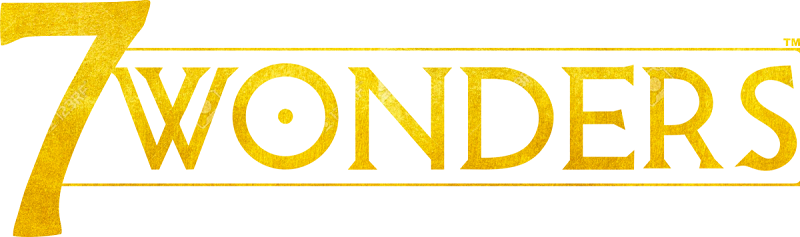

# UE Gestion de projet
## M1-S1-7W-MALTA

## 🏫 Groupe MALTA

- **M**eryem Boufalah
- **A**nastasiia Kozlova
- **L**oïc Filippi
- **T**igran Nersissian
- **A**lessandro Pepegna

## [⚙️ Milestones](https://github.com/uca-m1informatique-softeng/s2-gestiondeprojet-malta/milestones)

| Iteration | Date |
| --- | --- |
| ❌ [Iteration 0](https://github.com/uca-m1informatique-softeng/s2-gestiondeprojet-malta/milestone/1) | *09/02/2021* | 
| ❌ [Iteration 1](https://github.com/uca-m1informatique-softeng/s2-gestiondeprojet-malta/milestone/3)| *24/02/2021* |
| ❌ [Iteration 2](https://github.com/uca-m1informatique-softeng/s2-gestiondeprojet-malta/milestone/2)| *19/03/2021* |
| ❌ [Iteration 3](https://github.com/uca-m1informatique-softeng/s2-gestiondeprojet-malta/milestone/4)| *13/04/2021* |

## 🗂 Documentation
[Documentation Folder](https://github.com/uca-m1informatique-softeng/s2-gestiondeprojet-malta/tree/main/Documentation)

## 🚀 Releases
[Lien direct](https://github.com/uca-m1informatique-softeng/s2-gestiondeprojet-malta/releases)

## Defining the two AIs and the rules of the game

### Rules kept

We are keeping the rules of the first edition, with one exception : the wonder step's resources can be sold and bought.

### Safe AI

Strategy based on a **preference list**.
In ages I and II :

- a card providing 2 or more resource types is always played
- a card providing a single resource type that is lacking to the rbAI is always played
- a military card is always played if rbAI is not the only leader in military, and thecard allows rbAI to become the (or one of the) leading military player(s)
- the civil card with the greatest VP award is always played
- a science card is always played
- a random remaining card is played if possible, else a random card is discarded

In the third game age, the set of rules is superseded by choosing the decision with best immediate VP reward.

This is the rule-based AI taken from the [article](https://hal.inria.fr/hal-01406496/document) *Monte-Carlo Tree Search for the Game of ”7 Wonders”* by Denis Robilliard, Cyril Fonlupt and Fabien Teytaud.

### Ambitious AI

### Execution

&nbsp;    | 1000 game w/ no text | 1 game w/ text
--------- | ---------------------------------- | ------------------------------
3 players |       `exec:java@stats3p`          |        `exec:java@game3p`
5 players |       `exec:java@stats5p`          |        `exec:java@game5p`
7 players |       `exec:java@stats7p`          |        `exec:java@game7p`
