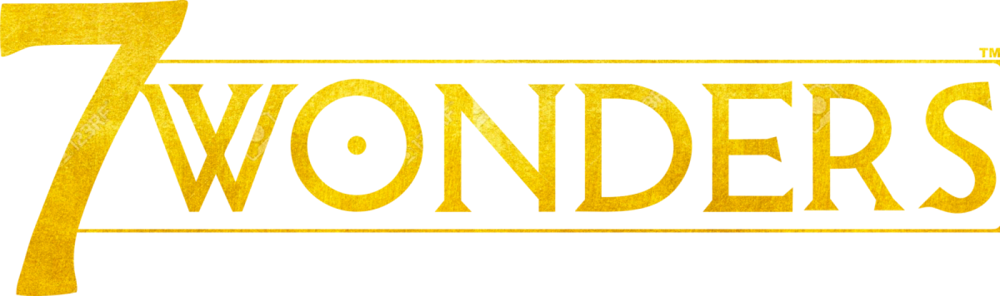

### Team members
- **L**oïc Filippi
- **A**lessandro Pepegna
- **M**eryem Boufalah
- **A**nastasiia Kozlova
- **C**haeyeon Shim

# Travail d'étude et de recherche

## Defining the two AIs and the rules of the game

### Rules kept

We are keeping the rules of the first edition, with one exception : the wonder's resources can be sold and bought.

### Safe AI

Strategy based on a **preference list**.
In ages I and II :

- a card providing 2 or more resource types is always played
- a card providing a single resource type that is lacking to the rbAI is always played
- a military card is always played if rbAI is not the only leader in military, and thecard allows rbAI to become the (or one of the) leading military player(s)
- the civil card with the greatest VP award is always played
- a science card is always played
- a random remaining card is played if possible, else a random card is discarded

In the third game age, the set of rules is superseded by choosing the decision withbest immediate VP reward.

This is the rule-based AI taken from the [article](https://guides.github.com/features/mastering-markdown/) *Monte-Carlo Tree Search for the Game of ”7 Wonders”* by Denis Robilliard, Cyril Fonlupt and Fabien Teytaud.

### Ambitious AI

### Execution

&nbsp;    | 1000 game w/ no text | 1 game with text
--------- | ---------------------------------- | ------------------------------
3 joueurs |       `exec:java@stats3p`          |        `exec:java@game3p`
5 joueurs |       `exec:java@stats5p`          |        `exec:java@game5p`
7 joueurs |       `exec:java@stats7p`          |        `exec:java@game7p`
